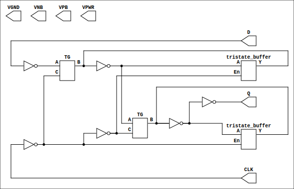

# sky130 Transistor Schematics

This project creates transistor schematics for the [sky130 PDK](https://github.com/google/skywater-pdk-libs-sky130_fd_sc_hd).



## Usage

```bash
make svg/cells/dfxtp/sky130_fd_sc_hd__dfxtp_1.svg
...
```

## Dependencies

* [Netlistsvg](https://github.com/nturley/netlistsvg)
